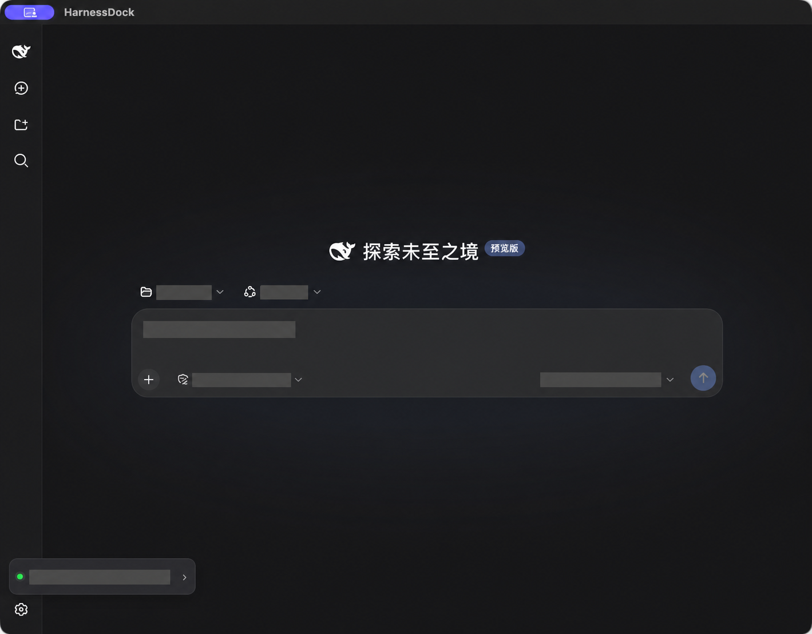

# HarnessDock for macOS

[English](README.md) · [简体中文](README.zh-CN.md)


**A native macOS workspace for DeepSeek Harness—with local project launching, API balance and peak/off-peak pricing, built-in DeepSeek Chat, custom backgrounds, and animated pets.**

HarnessDock wraps the official [DeepSeek Harness](https://github.com/deepseek-ai/deepseek-harness) web UI in a SwiftUI and WebKit desktop experience. Choose a local project, let the app start the pinned Harness runtime, and work without managing terminal commands or browser tabs.

> [!WARNING]
> HarnessDock is an independent, unofficial project and is not affiliated with or endorsed by DeepSeek. DeepSeek Harness is still a developer preview, so upstream changes may require compatibility updates.

## Screenshots



This preview uses redacted workspace, mode, model, prompt, and balance details. A larger sanitized gallery will be added before the public Product Hunt launch.

## Overview

HarnessDock is designed for developers who want the official Harness workflow to feel at home on macOS. The native shell handles project selection, runtime startup, recovery, logs, shortcuts, local settings, and presentation while the Harness UI continues to provide conversations, tools, approvals, and plugins.

## Latest Preview Update

The latest development build makes animated pets task-aware across both work surfaces:

- In **Harness**, the plugin follows the official current-session and background-job state.
- In **Chat**, the native pet reacts when DeepSeek starts generating, finishes successfully, or reports a new error.
- Success and failure feedback starts from the first frame, plays one complete animation cycle, and then returns to idle.
- The Chat bridge sends only `idle`, `running`, `succeeded`, or `failed` to native Swift code. It never reads or forwards prompts, replies, or page text.

These transitions are covered by the Harness plugin checks, Core checks, and a privacy-focused WebKit bridge simulation in `scripts/check-chat-pet-command.mjs`.

## Features

- **Native macOS shell** built with SwiftUI and WebKit—not Electron.
- **One-click local workspace launch** with the selected project used as the Harness working directory.
- **Pinned official runtime** using the verified `@deepseek-ai/dsh@0.1.0-rc.6` release and a matching local npm cache when available.
- **Harness and Chat tabs** that keep independent page and session state.
- **DeepSeek API balance** stored in macOS Keychain, with refresh and compact/collapsed sidebar states.
- **Peak/off-peak indicator and RMB pricing** for supported models, plus locally available input/output token usage.
- **Custom background image** with an adjustable content mask, stored only on the current Mac.
- **Bilingual native interface** with System Default, Simplified Chinese, and English options.
- **Version & Diagnostics** showing the app, pinned Harness runtime, macOS architecture, service state, and local Node/npx/dsh availability, with a privacy-safe copyable report.
- **Guided settings tour** explaining presets, permissions, appearance, send behavior, models, and plugins.
- **Task-aware animated pets on both surfaces**: the `@harnessdock/pet` plugin follows Harness sessions and background jobs, while the native Chat pet reacts to answer generation, success, and failure.
- **Reliable lifecycle management** that safely reuses a verified existing Harness service and cleans up processes started by the app.

## What HarnessDock Does Not Do

- It does not replace or reimplement DeepSeek Harness.
- It does not bypass DeepSeek Chat login; the Chat tab opens the official website and uses its normal account session.
- It does not copy a Keychain-only balance credential into Harness or inject credential values into web pages.
- It does not currently provide a signed, notarized, automatically updating consumer download.

## Requirements

| Dependency | Requirement |
| --- | --- |
| macOS | 14 Sonoma or later |
| Mac | Apple Silicon or Intel for source builds; the current local artifact is arm64 |
| Node.js | 24+ recommended; Node 22 requires 22.19+ |
| Swift | 6.0+ for source builds |
| Network | Required on first run if the pinned Harness package is not cached |

Check that Node.js and `npx` are available:

```bash
node --version
npx --version
```

## Installation

The repository currently supports source builds. It does **not** yet publish a Developer ID-signed and Apple-notarized installer.

```bash
git clone https://github.com/nortonyang/HarnessDock.git
cd HarnessDock
./scripts/build_app.sh
open dist/HarnessDock.app
```

The build script creates `dist/HarnessDock.app`, embeds the six release files for the pet plugin, and applies an ad-hoc signature for local testing. Do not redistribute this local artifact as a trusted consumer release.

## Usage

1. Open HarnessDock. If a previous workspace exists, **Enter** reopens it; otherwise choose a local project folder.
2. Wait until the status becomes **Local**. Harness starts on `127.0.0.1:3080` by default.
3. HarnessDock first uses `DEEPSEEK_API_KEY` from its own launch environment. For Finder or Dock launches, it falls back to reading only that exported variable from your interactive login shell. Its managed Harness process then uses official environment authentication; only when neither source is configured must you add model access in **Harness → Settings → Models**.
4. The same environment credential can power the native balance display. If it is unavailable, open **HarnessDock → Settings → API & Balance** and save a separate DeepSeek API key to Keychain.
5. Start a task in the official Harness interface, or switch to **Chat** for the official DeepSeek web chat.
6. To show the native pet in Chat, click the paw button in the upper-right toolbar and enable **Show native pet in Chat**. Harness pet settings remain under **Harness → Settings → Plugins → Desktop Pet**.

The first visit to Harness settings shows a six-step guide. It explains the available controls without changing them. Select **Quick Start** in the settings header to reopen the guide at any time.

### Harness and Chat

Harness provides project-aware agent workflows, tools, approvals, sessions, and plugins. Chat embeds `chat.deepseek.com`; it requires the normal DeepSeek account login because it is the official free chat service, not an API-key chat client. Login cookies are retained locally by WebKit.

In Chat, IME confirmation does not send the draft, modified Enter inserts a newline where supported, and an empty draft cannot create a message. File uploads happen only after the user selects a file and are sent directly to DeepSeek's official service.

## Privacy

- `DEEPSEEK_API_KEY` from the HarnessDock launch environment—or, when absent, that single exported variable resolved through the user's interactive login shell—is inherited by the managed Harness process for official environment authentication and can also be used for native balance lookup.
- HarnessDock does not import the shell's full environment. The resolved value stays in memory and is not persisted by this fallback.
- A balance credential saved only in macOS Keychain remains native-only and is not copied into Harness.
- Credential values are not written to the project, configuration files, Harness logs, or WebView scripts.
- Balance lookup makes a read-only request to `https://api.deepseek.com/user/balance`.
- Neither environment nor Keychain credentials are injected into the Harness or Chat webpage.
- Background image copies remain in this Mac's Application Support directory.
- Imported pet packages are read as JSON and image assets; their code is not executed.
- The Chat pet bridge accepts only `idle`, `running`, `succeeded`, or `failed`; it does not read or transmit prompts, replies, or page text.
- HarnessDock does not include analytics or crash reporting in the current preview.
- Copied diagnostics exclude API keys, cookies, conversations, full logs, and full workspace paths; home-directory tool paths are shortened to `~`.

Model pricing is displayed in RMB per million tokens using DeepSeek's [official Chinese pricing page](https://api-docs.deepseek.com/zh-cn/quick_start/pricing/) as the reference. Pricing can change; the official page and your account bill remain authoritative. Token counters are read from locally available Harness session statistics and may not represent complete account-wide usage.

## Appearance and Language

Open **Settings → Theme Background** or press `⇧⌘T` to import, replace, remove, or dim a local background image. Native app language can be set to **System Default**, **简体中文**, or **English**. Harness and Chat retain their own web-language preferences and are not reloaded when the native language changes.

## Pets

The Harness plugin lives in `plugins/harnessdock-pet` and is published locally as `@harnessdock/pet` with entry ID `pet`.

```bash
npm --prefix plugins/harnessdock-pet run build
npm --prefix plugins/harnessdock-pet run check
dsh plugin --profile web add ./plugins/harnessdock-pet
```

Restart Harness after installation. Open **Settings → Plugins → Desktop Pet** to select DeepWhale or Marina, hide the pet, or change its dock position.

When upgrading from the former DS Harness app, HarnessDock detects the exact legacy `@dsharness/pet` entry before starting a managed Harness service. It uses the official `dsh plugin` workflow to add the bundled `@harnessdock/pet` first and then remove the broken legacy link. If the App moves later, only an App-owned bundled-plugin link is updated to its current location; unrelated profiles and custom plugin sources are left unchanged.

The Harness pet follows the official session state: it runs while the current task or a background job is active, plays one success or failure animation when the task ends, and then returns to idle. It observes status only—it does not read, store, or transmit prompts, replies, command arguments, or tool output. Hover and click trigger character reactions; drag from a non-control area to move it, or hold `⌥ Option` when starting a drag over a Harness control. The pet snaps to the nearest left, right, or bottom edge and remembers its position.

The optional native pet layer is limited to Chat and reads compatible packages from `~/.codex/pets`, keeping it separate from the Harness plugin. It detects answer activity from semantic stop/error controls and sends only a fixed local status enum to Swift; message contents never cross the bridge.

| Task state | Harness pet | Chat pet |
| --- | --- | --- |
| Idle | Returns to the selected idle/interaction animation | Returns to the selected idle/interaction animation |
| Running | Follows the current session or active background job | Follows the visible answer-generation control |
| Succeeded | Plays one complete `review` cycle | Plays one complete `review` cycle |
| Failed | Plays one complete `failed` cycle for a new task error | Plays one complete `failed` cycle for a new semantic page error |

Command activity temporarily takes visual priority over hover and click reactions, but it does not change dragging, edge docking, saved position, package selection, or the user's enabled/disabled preference.

## Keyboard Shortcuts

| Action | Shortcut |
| --- | --- |
| Choose project | `⌘O` |
| New task | `⌘N` |
| Reload Harness | `⌘R` |
| Switch to Harness | `⌘1` |
| Switch to Chat | `⌘2` |
| API & Balance settings | `⇧⌘B` |
| Theme background | `⇧⌘T` |
| Desktop pet | `⇧⌘P` |
| Harness logs | `⇧⌘L` |

## Development

Run from source:

```bash
swift run HarnessDock
```

Use a specific workspace and port during development:

```bash
swift run HarnessDock --workspace /absolute/path/to/project --port 3095
```

Validate a local build:

```bash
./scripts/run_checks.sh
swift build
./scripts/build_app.sh
plutil -lint dist/HarnessDock.app/Contents/Info.plist
```

With a full Xcode installation, you can also run `swift test`. Command Line Tools-only systems may lack XCTest/Testing frameworks, so `run_checks.sh` provides framework-independent core checks.

## Project Structure

```text
HarnessDock/
├── Sources/                  # SwiftUI shell, WebKit integration, app state, and core services
├── Tests/                    # XCTest unit tests
├── Resources/                # Info.plist and app icon resources
├── plugins/harnessdock-pet/          # Official-slot Harness desktop pet plugin
├── scripts/                  # Build and validation scripts
└── docs/                     # Screenshots, plans, reviews, and release notes
```

## Upgrade and Uninstall

To upgrade a source build, quit HarnessDock, pull the latest source, rebuild, and reopen `dist/HarnessDock.app`. A running copy is not replaced automatically.

When upgrading from DS Harness, existing Chat cookies, local settings, backgrounds, imported pets, and the balance credential remain available. HarnessDock intentionally keeps the compatibility bundle identifier `app.dsharness.desktop` and its existing local storage/keychain service names; these internal identifiers are not the public product name.

To uninstall, quit the app and remove the locally built app. Optional user data such as preferences, imported backgrounds, WebKit cookies, and the Keychain balance credential remain until removed separately. No automated uninstaller is provided in this preview.

## Troubleshooting

- **Harness does not start:** confirm `node` and `npx` meet the requirements, then open Harness logs with `⇧⌘L`.
- **Need help identifying the environment:** open **Settings → Version & Diagnostics**, refresh the check, and copy the privacy-safe report.
- **Port 3080 is in use:** HarnessDock only attaches when the page contains the official Harness `__DSH_BOOT__` marker; otherwise it reports a conflict.
- **Chat asks for login:** this is expected. The tab loads the official DeepSeek Chat service and cannot use the Harness API key as a web login.
- **The Chat pet is not visible:** switch to Chat, click the paw button in the upper-right toolbar, enable the native pet, and confirm that a valid package is selected. The enabled state is remembered locally.
- **Balance is unavailable:** configure the balance key in Settings, check network access, and refresh. This key is separate from Harness model settings.
- **macOS blocks the app:** the current source build is ad-hoc signed and not notarized. Build it locally for testing; a public release still needs Developer ID signing and Apple notarization.

## Current Release Status

Version `0.1.0` is a developer preview. Before a public Product Hunt download is described as production-ready, the project still needs:

- a clean release changelog;
- a Developer ID-signed, Apple-notarized package;
- Universal 2 or clearly separated architecture-specific artifacts;
- clean-Mac installation and smoke testing;
- checksums and a documented upgrade/uninstall path.

See the [public release readiness review](docs/release-readiness.md) for the detailed checklist.

## Support

Found a bug or have a feature idea? Open a [GitHub issue](https://github.com/nortonyang/HarnessDock/issues) with the copied **Version & Diagnostics** report, reproduction steps, and only the relevant Harness log lines. Do not include API keys, login cookies, private code, or other secrets.

## License

HarnessDock is open source under the [MIT License](LICENSE). The license permits use, modification, distribution, sublicensing, and commercial use while requiring the copyright and license notices to be retained. The software is provided without warranty.

## Acknowledgements

- [DeepSeek Harness](https://github.com/deepseek-ai/deepseek-harness) for the official agent runtime and web interface.
- [DeepSeek API documentation](https://api-docs.deepseek.com/) for balance and pricing references.
- Apple's SwiftUI, WebKit, and Keychain technologies for the native macOS shell.
