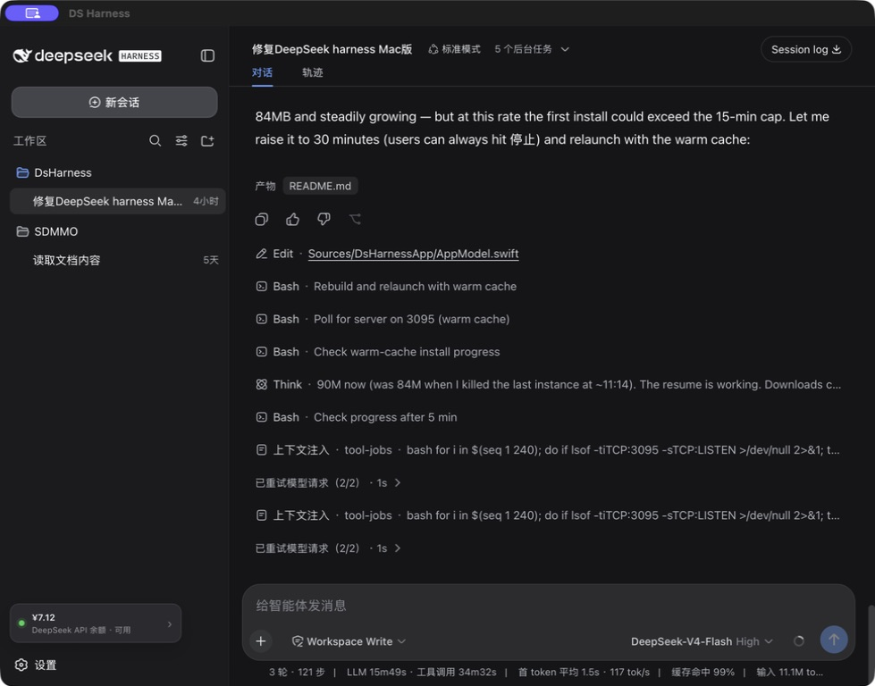
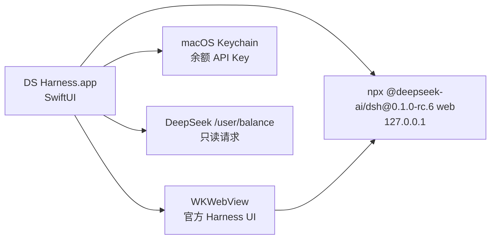

# DS Harness for macOS


一个面向 macOS 的非官方 [DeepSeek Harness](https://github.com/deepseek-ai/deepseek-harness) 桌面客户端。它用 SwiftUI 和 WebKit 提供原生应用体验，并在本机自动启动官方 `@deepseek-ai/dsh` Web UI。

> [!WARNING]
> 本项目不代表或隶属于 DeepSeek。DeepSeek Harness 仍处于 developer preview，上游更新可能带来不兼容变更。



## 为什么使用 DS Harness

- **原生 macOS 体验**：项目选择、启动状态、错误恢复、日志和常用菜单均由 SwiftUI 提供。
- **自动启动官方 Harness**：锁定已验证的 `@deepseek-ai/dsh@0.1.0-rc.6`；优先复用版本匹配的本地缓存，并以所选项目为工作目录启动 `dsh web`。
- **沉浸式工作区**：官方 Harness Web UI 直接铺满窗口，外部链接交给系统默认浏览器。
- **内嵌官方免费聊天**：在标题栏切换 Harness 与 `chat.deepseek.com`，两个页面保持各自的会话状态。
- **余额一眼可见**：在 Harness 侧边栏显示 DeepSeek CNY/USD 余额，支持刷新、错误提示和折叠态。
- **自定义主题背景**：从 Mac 导入一张本地图片作为工作区背景，可调整内容遮罩并随时移除。
- **Harness 桌面宠物插件**：正式 DSH bundle/client 插件，安装后在 Harness 插件列表显示为 `pet`，并在“插件 → 桌面宠物”中切换 DeepWhale / Marina。
- **原生宠物层（可选）**：macOS 外壳仍可只读发现 Codex 兼容宠物包，仅在 Chat 页面用于本地预览、导入和缩放，不覆盖 Harness 控件。
- **凭据留在本机**：余额 API Key 可从 `DEEPSEEK_API_KEY` 读取，或存入 macOS 钥匙串，不写入项目文件与 Harness 日志。
- **可靠的进程管理**：识别并安全附着已有 Harness；退出时清理本应用启动的整棵进程树，减少端口残留。

## 环境要求

| 依赖 | 要求 |
| --- | --- |
| macOS | 14 Sonoma 或更高版本 |
| Mac | Apple Silicon 或 Intel |
| Node.js | 24+；Node 22 至少需要 22.19 |
| Swift | 6.0+（仅源码构建需要） |
| 网络 | 首次运行需要从 npm registry 下载官方 Harness |

先确认 Node.js 与 `npx` 可用：

```bash
node --version
npx --version
```

## 快速开始

当前仓库提供源码构建，尚未提供 Developer ID 签名的安装包。

```bash
git clone https://github.com/nortonyang/DsHarness.git
cd DsHarness
./scripts/build_app.sh
open dist/DsHarness.app
```

构建脚本会生成 `dist/DsHarness.app`，把宠物插件的 6 个发布文件嵌入应用 Resources，并执行本机 ad-hoc 签名。已有匹配版本的 npm 缓存时会直接启动；首次缺少缓存时可能需要几分钟下载依赖，应用会持续显示启动进度。

## 首次使用

1. 打开应用，选择一个本地代码目录。
2. 等待状态变为“本地”，应用会在 `127.0.0.1:3080` 启动 Harness。
3. 在 Harness 的 **Settings → Models** 中配置模型所需的 DeepSeek API Key。
4. 如需显示账户余额，打开 **DS Harness → 设置 → API 与余额**，将 Key 单独保存到 macOS 钥匙串；余额面板里的“配置 API Key”也会打开同一设置窗口。也可以在启动应用前设置 `DEEPSEEK_API_KEY`。检测到已有凭据时，设置页只显示“已配置”状态；点“更换 API Key”后才出现新的输入框。
5. 回到官方 UI，确认工作区后开始任务。

首次打开 Harness 设置页时，应用会显示一次 6 步中文引导，解释通用设置、预设、权限、外观、繁忙时发送行为、模型和插件。完成后不会重复打扰；随时可以点击设置页右上角的 **新手引导** 再看。引导只做讲解，不会替你修改设置。

余额面板同时显示 DeepSeek API 当前处于高峰还是谷时、下一次切换时间，以及 V4 Flash、V4 Pro 的人民币输入命中、输入未命中和输出单价。侧栏和面板还会复用 Harness 本地统计，显示当前会话已经使用的输入与输出 tokens；没有用量时显示“暂无用量”。实际计费以 DeepSeek 中文官方价格页为准。

如需自定义外观，点击 Harness 左侧栏的 **主题背景**，或按 `⇧⌘T`，应用会打开统一设置窗口中的“主题背景”栏目；可选择本地图片并调整内容遮罩。导入副本只保存在当前 Mac 的 Application Support 中。

标题栏可在 **Harness** 与 **Chat** 之间切换，也可以使用 `⌘1` / `⌘2`。Chat 首次打开时才加载 DeepSeek 官方网页，登录 Cookie 由本机 WebKit 保存；应用不会把 Harness 的 API Key、余额或工作区数据传给聊天页面。聊天页中的文件上传由用户主动选择，并直接交给 DeepSeek 官方服务处理。

真正的 Harness 插件位于 `plugins/dsh-pet`，包名为 `@dsharness/pet`、Loader 条目 ID 为 `pet`。构建并执行 `dsh plugin --profile web add ./plugins/dsh-pet` 后重启 Harness，即可在“设置 → 插件 → 插件列表”看到 `pet`，并在“设置 → 插件 → 桌面宠物”切换 **DeepWhale** / **Marina**、隐藏宠物或选择左侧、右侧、底部停靠。宠物会隐藏部分身体并周期性探出；悬停、点击、拖动分别触发观察、跳跃、奔跑动作。可从非控件背景直接拖动，盖在按钮上时按住 `⌥ Option` 可强制拖动；松手自动吸附最近边框并保存位置。普通点击仍传给下方 Harness 控件。插件通过官方 `shell.overlay` 与 `settings.plugins.tab` 插槽接入，不修改 Harness 内置包。

Chat 页面标题栏爪印按钮和 `⇧⌘P` 打开的则是 macOS 原生宠物层，用于本地宠物包预览和导入，与上面的 Harness 插件是两个清晰分离的入口。切换到 Harness 后，原生宠物和爪印按钮会隐藏，由正式 `pet` 插件独占宠物显示，避免重复渲染或遮挡 Harness 按钮。原生层会只读扫描 `~/.codex/pets`，并支持导入包含 `pet.json` 和 `spritesheet.webp` 的文件夹。两种实现共用 Codex 8×9 图集格式（1536×1872 像素，每格 192×208）；宠物包只作为 JSON 与图片读取，不会执行其中的代码。

如果已经打开旧版 DsHarness，请先退出旧进程，再运行 `./scripts/build_app.sh` 并重新打开 `dist/DsHarness.app`；运行中的旧进程不会自动替换为新构建。

> [!NOTE]
> 模型配置、会话、工具审批和插件由官方 Harness 管理。余额功能不会读取 Harness 内部凭据，只使用你明确提供给桌面应用的 Key，并仅请求 DeepSeek 官方的只读 `/user/balance` 接口。

## 常用快捷键

| 操作 | 快捷键 |
| --- | --- |
| 选择项目 | `⌘ O` |
| 新任务 | `⌘ N` |
| 重新加载 Harness | `⌘ R` |
| 切换到 Harness | `⌘ 1` |
| 切换到免费聊天 | `⌘ 2` |
| API 与余额设置 | `⇧ ⌘ B` |
| 主题背景 | `⇧ ⌘ T` |
| 桌面宠物插件 | `⇧ ⌘ P` |
| 查看 Harness 日志 | `⇧ ⌘ L` |

## 开发运行

构建并检查 Harness 宠物插件：

```bash
npm --prefix plugins/dsh-pet run build
npm --prefix plugins/dsh-pet run check
```

安装到当前用户的 Harness `web` profile：

```bash
dsh plugin --profile web add ./plugins/dsh-pet
```

插件集合在 Harness 启动时扫描；安装后需要重启 Harness 服务。

直接从源码启动：

```bash
swift run DsHarness
```

调试时可以预先指定项目和端口：

```bash
swift run DsHarness --workspace /absolute/path/to/project --port 3095
```

| 参数 | 默认值 | 说明 |
| --- | --- | --- |
| `--workspace <path>` | 上次打开的项目 | 跳过目录选择器并打开指定工作区 |
| `--port <1...65535>` | `3080` | 指定本地 Harness Web 服务端口 |

## 工作方式



- GUI 应用即使从 Finder 启动，也会查找 PATH、Homebrew、Volta、`~/.local/bin`、nvm、fnm、asdf 和 mise 中的 `npx`；同时读取 npm 缓存位置，只复用 `package.json` 版本完全匹配的 DSH 运行文件。
- 发现目标端口已被占用时，只有响应 HTML 包含官方 Harness 的 `__DSH_BOOT__` 标记才会附着，否则会明确报错。
- 余额凭据不会传给 Harness 子进程；官方 Harness 的模型凭据仍由其自身设置管理。
- 正常退出应用时，只会停止由当前应用创建的 Harness 进程，不会终止安全附着的外部服务。

## 项目结构

```text
DsHarness/
├── Sources/
│   ├── DsHarnessApp/          # SwiftUI、WebKit、钥匙串和应用状态
│   ├── DsHarnessCore/         # 启动配置、运行时定位、余额和进程管理
│   └── DsHarnessCoreChecks/   # 无 XCTest 依赖的核心检查
├── Tests/                     # XCTest 单元测试
├── Resources/                 # Info.plist 与应用图标
├── scripts/                   # 构建及验证脚本
└── docs/                      # 截图、开发计划与审核记录
```

## 验证

```bash
./scripts/run_checks.sh
swift build
./scripts/build_app.sh
plutil -lint dist/DsHarness.app/Contents/Info.plist
```

仓库保留了 XCTest 测试目标；安装完整 Xcode 后还可以运行：

```bash
swift test
```

仅安装 Command Line Tools 的系统可能不包含 XCTest/Testing 框架，因此 `run_checks.sh` 提供了不依赖测试框架的核心检查。

## 已知限制

- 依赖本机 Node.js，未捆绑离线运行时。
- 尚未提供端口设置界面；可通过 `--port` 在调试时覆盖默认端口。
- 尚无 Developer ID 签名、公证、DMG、自动更新或崩溃上报。
- 当前构建脚本只输出构建机器自身架构；公开提供 Intel + Apple Silicon 下载前需生成 Universal 2 包。
- 桌面宠物目前只显示在 DsHarness 窗口内，不是跨应用的独立桌面悬浮窗口。
- 余额组件通过独立的 WKWebView user script 注入；如果上游彻底调整侧边栏结构，可能需要适配。
- `kill -9` 等强制退出方式无法执行清理；使用 `⌘ Q` 或应用菜单退出可正常停止进程树。

## 公开发布提醒

当前构建只适合本地测试。公开 GitHub 源码或 Release 前，还需要替换当前由 SF Symbols 生成的 AppIcon、选择本项目许可证、锁定 Harness 版本、脱敏截图，并完成 Developer ID 签名与 Apple 公证。风险分级和逐项发布清单见 [GitHub 公开发布审核](docs/release-readiness.md)。

## 更多文档

- [macOS 客户端总体规划](docs/development/codex-style-macos/00-master-plan.md)
- [实施方案](docs/development/codex-style-macos/02-implementation-plan.md)
- [代码审核报告](docs/development/codex-style-macos/04-review-report.md)
- [GitHub 公开发布审核](docs/release-readiness.md)
